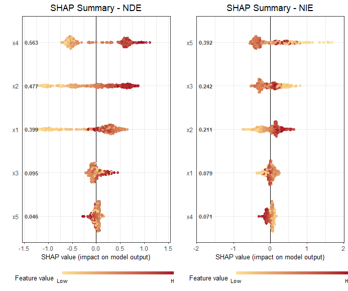
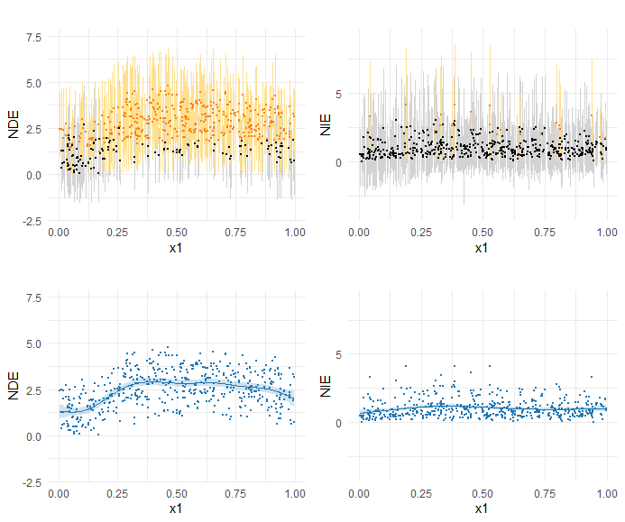
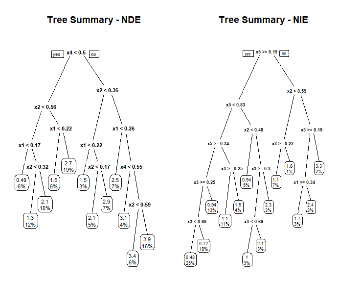

R code implementation of Heterogeneous Causal Mediation Analysis Using Bayesian Additive Regression Trees

### Installation

This package is build on `bartMachine` package in R, you will first need to install Java and `rJava` package and configure your computer, then you can install the package from CRAN or compile from source. Detailed instructions are on <https://github.com/kapelner/bartMachine>.

```R
if (!"devtools" %in% rownames(installed.packages())) {
  install.packages('devtools')
}

# install the HMBART R package
devtools::install_github('Lewis-ChenLiu/HMBART')

# load, adjust storage and num_cores according to the environment
options(java.parameters = "-Xmx8g")
library(bartMachine)
set_bart_machine_num_cores(num_cores = 10)
library(HMBART)
```

### Example

In this part, we will show how to use HMBART with a simulated dataset. The dataset `data.rds` is included, and more details about the scenario can be found in Case (4) of our paper.

##### Estimation

```R
### Default setting
hmbart_obj = hmbart(data, X = c('x1', 'x2', 'x3', 'x4', 'x5'), t = 't', m = 'm', y = 'y')

### Cross validation
# hmbart_obj = hmbart(data, X = c('x1', 'x2', 'x3', 'x4', 'x5'), t = 't', m = 'm', y = 'y', CV = TRUE)

> head(hmbart_obj$effects)
        TE       TE.l     TE.u       NDE      NDE.l    NDE.u       NIE      NIE.l    NIE.u
1 3.932867  1.6050965 6.644100 2.8208519  1.1737146 5.060531 1.1120149 -1.3211790 3.883400
2 1.920392 -0.1314570 4.100765 1.3240281 -0.3432851 3.016575 0.5963642 -0.6991594 2.214197
3 5.054568  1.8358222 8.923401 2.3576828  0.8865221 3.683696 2.6968853  0.0000000 6.392640
4 4.765372  2.9060400 7.505387 3.7823592  2.5432603 5.381703 0.9830128 -0.5238947 3.369680
5 3.053114  1.1543714 5.210438 2.2828638  1.0364591 4.198749 0.7702501 -1.2907950 2.768051
6 1.080673 -0.4419588 3.077158 0.5732811 -0.5398795 1.971616 0.5073916 -0.7375299 2.207598

```

##### Visualization

```R
### SHAP plot
shapplot(hmbart_obj)
```

The SHAP plot ranks variables by importance (top to bottom), with yellow indicating small values and red indicating large values.



```R
### Dependent plot
dependentplot(hmbart_obj, 'x1')
```

Dependency plots show how NDE and NIE change with the variable. Individual estimates are depicted as orange or black dots, with yellow or gray credible intervals; orange dots and yellow shades indicate statistically significant estimates. A GAM fit illustrates the trend, with blue dots for individual estimates and a blue curve tracing the smoothed NDE/NIE changes over the variable.



```R
### Tree plot
treeplot(hmbart_obj)
```

Decision trees to identify subgroups, with branch conditions defining moderators. Node values show estimated effects, and percentages represent subgroup proportions.



### Debug Tips

The most common error encountered is `java.lang.OutOfMemoryError`. To address this, we recommend the following steps: 

**1. Increase Memory Allocation**

```R
options(java.parameters = "-Xmx32g")
```

Here, `-Xmx32g` increases the maximum heap size to 32GB. You can customize this value based on your system's available memory.

**Important**: Restart your R session after making this change.

**2. Reduce** `n_process_samples`

Lower the `n_process_samples` parameter to reduce memory usage during model execution. For example:

```
### Default setting
hmbart_obj = hmbart(data, X = c('x1', 'x2', 'x3', 'x4', 'x5'), t = 't', m = 'm', y = 'y', n_process_samples = 1e4)
```

Decreasing this value reduces memory usage but increases runtime, making it suitable for systems with limited memory.
