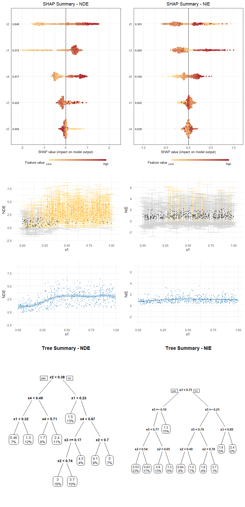

R code implementation of Heterogeneous Causal Mediation Analysis with Bayesian Additive Regression Trees

### Installation

```R
if (!"devtools" %in% rownames(installed.packages())) {
  install.packages('devtools')
}

# install the HMBART R package
library(devtools)
if (!"HMBART" %in% rownames(installed.packages())) {
  install_github('Lewis-ChenLiu/HMBART')
}

# load, adjust storage and num_cores according to the environment
options(java.parameters = "-Xmx64g")
library(bartMachine)
set_bart_machine_num_cores(num_cores = 10)
library(HMBART)
```

### Example

In this part, we will show how to use HMBART with a simulated dataset.

```R
### Generate data
gen = function(n){
  
  sigma.m = 1; sigma.y = 1; 
  e.m = rnorm(n, 0, sigma.m)
  e.y = rnorm(n, 0, sigma.y)
    
  x1 = runif(n); x2 = runif(n); x3 = runif(n); x4 = runif(n); x5 = runif(n);
  ps = plogis(x2 * x3 - x4 * x5)
  t = rbinom(n, 1, ps)
  
  b0.m = 1 / (x1 + 1) + x2 
  b1.m = 2 * abs(x3 - 0.5)
  
  b0.y = x5
  b1.y = 2 * x4
  b2.y = 4 * (x5 - 0.5)^2
  b3.y = 2 * sin(pi * x1 * x2)
  
  m = b0.m + b1.m * t + e.m
  y = b0.y + b1.y * t + b2.y * m^2 + b3.y * t * m + e.y
  
  m0 = b0.m
  m1 = b0.m + b1.m
  y1m1 = b0.y + b1.y + b2.y * m1^2 + b3.y * m1
  y1m0 = b0.y + b1.y + b2.y * m0^2 + b3.y * m0
  y0m0 = b0.y + b2.y * m0^2
  
  true_TE = y1m1 - y0m0
  true_NIE = y1m1 - y1m0
  true_NDE = y1m0 - y0m0
  
  data = cbind.data.frame(x1 = x1, x2 = x2, x3 = x3, x4 = x4, x5 = x5,
                          t = t, m = m, y = y, true_TE, true_NIE, true_NDE)
  
  return(data)
}

data = gen(500)
```

##### Estimation

```
### Default setting
hmbart_obj = hmbart(data, X_name = c('x1', 'x2', 'x3', 'x4', 'x5'), t_name = 't', m_name = 'm', y_name = 'y')

### Cross validation
# hmbart_obj = hmbart(data, X_name = c('x1', 'x2', 'x3', 'x4', 'x5'), t_name = 't', m_name = 'm', y_name = 'y', CV = TRUE)

> head(hmbart_obj$effects)
        TE       TE.l     TE.u      NDE       NDE.l    NDE.u       NIE      NIE.l    NIE.u
1 3.735600  1.2307954 6.771175 2.919720  1.04763439 5.053429 0.8158800 -0.9256589 3.487182
2 2.710184  0.4905572 5.084135 2.104954  0.25117779 3.796468 0.6052298 -0.9629884 2.785807
3 1.961961 -0.0735026 4.068640 1.637126 -0.13325504 3.424064 0.3248344 -1.2648673 2.097993
4 1.884478 -0.0416991 4.052631 1.542105 -0.06756335 3.196514 0.3423738 -0.9965982 2.112362
5 2.575909  0.1687347 5.236323 1.990379  0.23918237 3.460496 0.5855296 -1.4740843 2.937700
6 4.259714  1.9944826 7.086448 3.633967  1.91310495 5.456703 0.6257468 -1.0851516 2.937125

```

##### Visualization

```
### SHAP plot
shapplot(hmbart_obj)

### Dependent plot
dependentplot(hmbart_obj, 'x1')

### Tree plot
treeplot(hmbart_obj)
```

