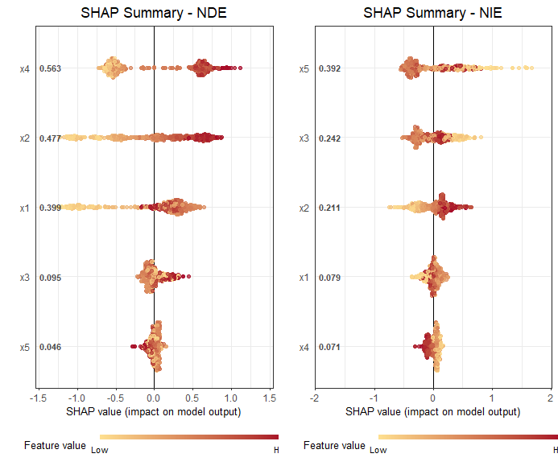
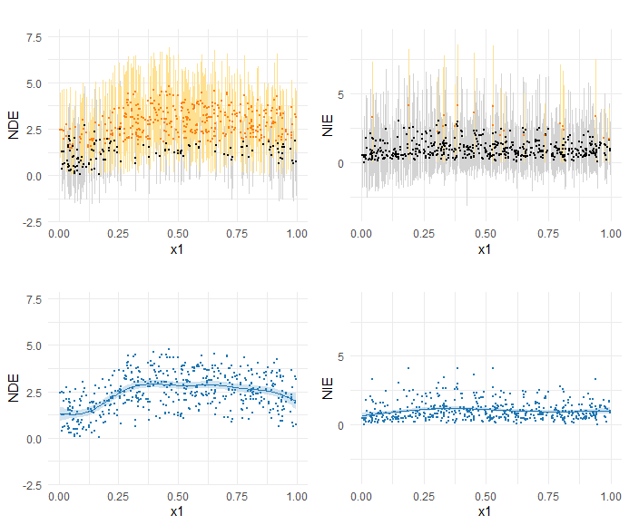
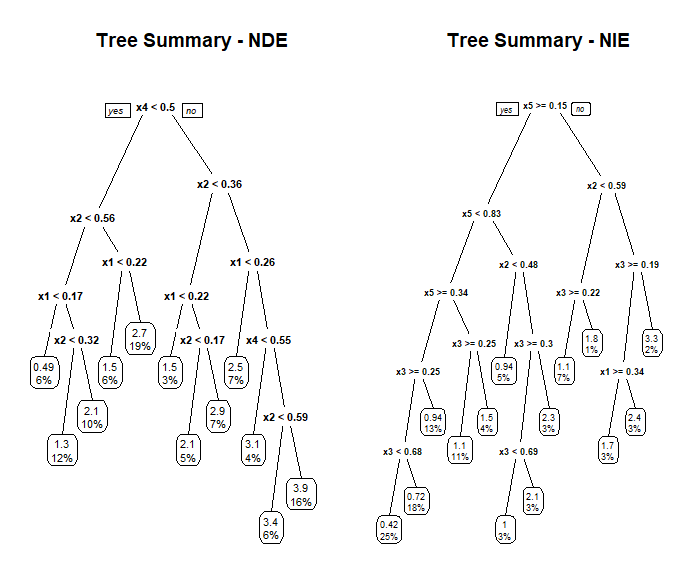

R code implementation of Heterogeneous Causal Mediation Analysis Using Bayesian Additive Regression Trees.

### Installation

This package is build on `bartMachine` package in R, you will first need to install Java and `rJava` package and configure your computer, then you can install the package from CRAN or compile from source. Detailed instructions are on <https://github.com/kapelner/bartMachine>.

```R
if (!"devtools" %in% rownames(installed.packages())) {
  install.packages('devtools')
}

# install the HMBART R package
devtools::install_github('Lewis-ChenLiu/HMBART')

# load, adjust storage and num_cores according to the environment
options(java.parameters = "-Xmx8g")
library(bartMachine)
set_bart_machine_num_cores(num_cores = 10)
library(HMBART)
```

### Example

In this part, we will show how to use HMBART with a simulated dataset. The dataset `data.rds` is included, and more details about the scenario can be found in Case (4) of our paper.

##### Estimation

```R
### Default setting
hmbart_obj = hmbart(data, X = c('x1', 'x2', 'x3', 'x4', 'x5'), t = 't', m = 'm', y = 'y')

### Cross validation
# hmbart_obj = hmbart(data, X = c('x1', 'x2', 'x3', 'x4', 'x5'), t = 't', m = 'm', y = 'y', CV = TRUE)

> head(hmbart_obj$h_effects)
        TE       TE.l     TE.u       NDE      NDE.l    NDE.u       NIE      NIE.l    NIE.u
1 3.932867  1.6050965 6.644100 2.8208519  1.1737146 5.060531 1.1120149 -1.3211790 3.883400
2 1.920392 -0.1314570 4.100765 1.3240281 -0.3432851 3.016575 0.5963642 -0.6991594 2.214197
3 5.054568  1.8358222 8.923401 2.3576828  0.8865221 3.683696 2.6968853  0.0000000 6.392640
4 4.765372  2.9060400 7.505387 3.7823592  2.5432603 5.381703 0.9830128 -0.5238947 3.369680
5 3.053114  1.1543714 5.210438 2.2828638  1.0364591 4.198749 0.7702501 -1.2907950 2.768051
6 1.080673 -0.4419588 3.077158 0.5732811 -0.5398795 1.971616 0.5073916 -0.7375299 2.207598

```

##### Visualization

```R
### SHAP plot
shapplot(hmbart_obj)
```

The SHAP plot ranks variables by importance from top to bottom. Each row corresponds to one variable and each dot corresponds to one individual. The horizontal position of a dot is the SHAP value of that variable for that individual, which measures how far the variable moves the estimated effect away from the average effect. Dots on the right indicate an upward contribution and dots on the left indicate a downward contribution. The color encodes the value of the variable itself, with yellow for small values and red for large values. The number printed beside each variable name is the mean absolute SHAP value, which is the quantity used for the ranking. A variable whose colors separate cleanly from one side to the other is acting as a moderator, because the direction of its contribution depends on its own value. The panels for NDE and NIE are fitted separately, so the two rankings may differ.



```R
### Dependence plot
dependenceplot(hmbart_obj, 'x1')
```

The two columns correspond to the two effects, and the rows present the same individual estimates in two different ways. In the upper row each individual is plotted at its own value of the variable, with a vertical line covering the credible interval of that individual effect. The color marks whether the interval excludes zero. Orange dots with yellow intervals are individuals whose effect is statistically significant, meaning that the credible interval lies entirely above or entirely below zero, and black dots with grey intervals are individuals whose interval still covers zero. The location of the orange dots therefore shows over which range of the variable the effect can be distinguished from zero. The lower row summarizes the same estimates with a generalized additive model fitted to the individual point estimates. Blue dots are the individual estimates, the blue curve is the fitted trend, and the blue band is the 95 percent confidence band of that fitted trend. The band describes uncertainty in the estimated shape of the trend and should not be read as the spread of the individual effects, which is shown in the upper row instead. A curve that is close to flat indicates that the variable does not moderate the effect, while a curve with a clear slope or bend indicates moderation.



```R
### Tree plot
treeplot(hmbart_obj)
```

The tree plot approximates the individual estimates with a regression tree so that the heterogeneity can be read as a small number of subgroups. Each split reports the variable and the cut value that best separate individuals with different effects, so the variables appearing in the tree are the estimated moderators. Following a path from the root to a leaf gives the definition of one subgroup. Within each leaf the upper number is the average estimated effect in that subgroup and the lower number is the percentage of the sample falling into it. The trees for NDE and NIE are grown separately and may select different variables and different cut values. The tree summarizes the fitted effects rather than defining a new model, so the leaf values inherit the uncertainty of the individual estimates and leaves covering a small percentage of the sample should be interpreted with caution.



### Debug Tips

The most common error encountered is `java.lang.OutOfMemoryError`. To address this, we recommend the following steps: 

**1. Increase Memory Allocation**

```R
options(java.parameters = "-Xmx32g")
```

Here, `-Xmx32g` increases the maximum heap size to 32GB. You can customize this value based on your system's available memory.

**Important**: Restart your R session after making this change.

**2. Reduce** `n_process_samples`

Lower the `n_process_samples` parameter to reduce memory usage during model execution. For example:

```
### Default setting
hmbart_obj = hmbart(data, X = c('x1', 'x2', 'x3', 'x4', 'x5'), t = 't', m = 'm', y = 'y', n_process_samples = 1e4)
```

Decreasing this value reduces memory usage but increases runtime, making it suitable for systems with limited memory.
